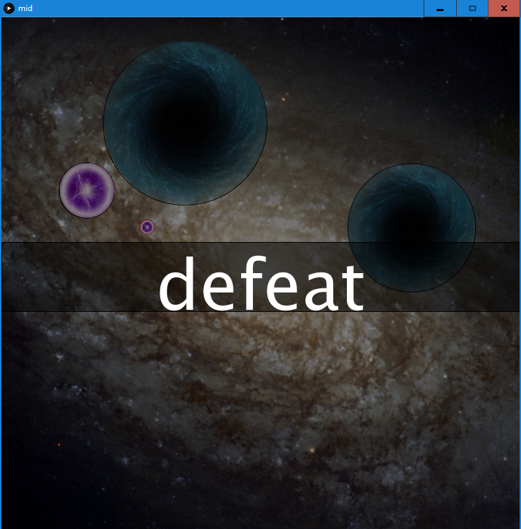

## FINAL ASSIGNMENT

### RATIONALE

The project is a follow up on the midterm assignment, a simple game in which player takes command of a small and roundish spaceship with the objective to clear the stage by moving all the meteorites to the black holes and proceed to the next one. This time - with the Arduino controller.

The controller is based on servo rotary motor (referred to as 'rotor') used as an input, red and blue button and corresponding LEDs for aesthetics. Rotor allows player to rotate the ship, changing its current direction. Pressing the red button starts charging the engine and upon release it launches the spaceship forward (that is in the direction given by rotor input) with velocity proportional to the time the button have been pressed down. The blue button is used to fire a series of bullets i nthe direction of motion. Keeping the button down fires a longer series. Both buttons also lit a corresponding LED when pressed.

The change of the controler adds an unique character to the game. Having a custom-made steering wheel clearly beats the need to click the little circle of your moving spaceship in order to alter its motion and overall game feels more 'internally' then 'externally' driven (steering ships control panel as opposed to steering it frou the 'outside'). The increase of ease and slight decrease of precission of controls (the hand muscles are not symmetric and turn-right not always is felt with simmilar strength as equal turn left) also influences the pace of the game to be more 'fluent yet risky'.

The rest of mechanics is with minimum to none change. The meteors still can be moved indirectly via collisions with the ship or bullets that player can shoot in the direction of motion. The collission coefficient is proportional to the mass (size) of the collided object. (However immovable objects like black holes do not experience pushback, thus can be deemed of infinite innertia or immaterial.) Player can collide with own bullets, experiencing similar pushback. The ship falling into the black hole results in failure and reset of the current stage.

Every fifth stage the black holes are replaced with a boss entity, capable of repetitive motion and shooting own bullets. The aim remains unchanged, push all the meteorites into the boss avoiding falling in yourself.

Overall, levels were chosen to be generated randomly, without a seed. The number of emerging structures (meteorites and black holes) is also random, with stage-proportional upper cap. Generation of boss stages is slightly different, but subjected to simmilar rules.

### ARDUINO SETUP

- circuit scheme\

- the controller\

- the controller - rotor input\

- the controller - buttons and LEDs\

### RESULTS

- Player, Meteorite (actually an energy sphere) and a black (actually a dark celadon) hole\

- rotor input changes the direction. direction also changes upon collissions\

- pressing the red button charges the engine (red line). releasing the button adds forward velocity proportional to the charge\

- blue button shoots bullets\

- once the meteorite is removed the victory massage appears\

- and onto the next stage!\

- sometimes things go wrong\

- few stages pass and suddenly the music changes\

- the boss fight...\

- ...continues\

### VIDEO

(couldn't embed, for the video consult final.mp4 file. sorry for low quality, Github wouldn't allow allow upload without reduction.)

### CODE

For the code consult the code.pde file, because with documentation it is over 1000 lines.

### EXTERNAL SOURCES

  - The basis for the electric scheme for rotor input (for positive and negative voltage) was taken from StackExchange
    - source: https://electronics.stackexchange.com/questions/108320/read-positive-and-negative-voltage-in-arduino
    - the basic idea was modified and adjusted according to the aviable resources
  - All images are sourced from google images
    - Lego Star Wars Millenium Falcon model was used as the Player object texture. The choice was made due its roundish shape
    - common pngs were used for meteorite/bullet and black hole textures
    - png of Cromulon from Rick and Morty show was used for the Boss and BossBullet objects, as the author deemed its characteristics fitting for the overall feel of the game
  - Sounds were either composed, sourced from soundfile storage sites or converted from youtube
    - the main music was composed by author using MuseScore a longer while ago, independently of the project
    - Nightcore My Demons was used for boss music due its faster and more aggresive pace, converted from youtube
    - the laser sound effect was taken from Soundfishing website
    - the boss quotes played at start or conclusion of the boss stage were converted from youtube and are associated with the same show as the boss texture

### CHANGES SINCE MIDTERM

- Arduino controller was added
  - the basic controlls and gameplay were changed accrdingly
  - the old keyboard input was disabled, as it did no longer fit in the new rotatory controlls
  - tension, friction and maximum velocity coefficients were reviewed to adjust the gameplay to the new cntroller mode
- Arduino controller mode fixes
  - several changes and fixes were made to allow proceeding between screens (win -> next stage -> play; lose -> restart and play) using Arduino buttons, fixed issue when prolonged press of the button would cause to skip multiple screens (skipping from win to play without signaling next stage)
  - fixed issue with bullets by rewriting shoot() function in Player in terms of the place bullets were created. Initial position of the bullets (relative to the spaceship) and the formula for adding their base velocities to the ship velocity (in other words, faster the ship moves the faster bullets are fired (with greater velocity component in the direction of motion)) was rebalanced. Now utilises PVector more effectively and avoids situations when emerging bullet would instantly collide with the Player object causing it to bounce backwards.
  - several minor fixes and adjustments
- display adjustment
  - since now the dirrection of the ship is not clearly indicated by its movement (the ship can rotate in place or independently of its trajectory), a small blue back-forth line beneath the ship texture was added for clarity.
  - the pullback line from previous version still apears, but now is being induced by the red button and increases according to the time button have been pressed. The cycles-to-length factor was balanced for clarity.
- rebalancing
  - the minimum size of generated pucks and holes was increased to avoid non-rewarding situations
  - several minor fixes, adjustments and code aesthetics
- music
  - both regular music and boss music are now called by loop() function, resolving the problem where the gameplay in given stage(s) would last longer then music time (~4mins)

### FURTHER DEVELOPMENT
- hybrid input
  - redefining new keyboard controlls to allow keyboard input for the new rotary mode
- restructurisation
  - as suggested in June 3 and midterm assignment submissions, embracing more suitable OOP patterns, such as decorator, will make the overall structure more flexible and allow for more efficient addition of the functionalities.
  - keeping the object functions, such as collission effects or movement capabilities independent rather then aggregated within given type will allow to create specific objects with desired functionality packages, going beyond the limits of Player-Puck-Hole-Bullet design.
  - This in turn would add more variety among the stages
- rebalancing
  - adding more variety to the bosses, such as player-directed movement or gravity-pull, could make the fights less repetetive and more challenging.
- bug fixes
  - the issue of self-fueling collisions occuring when object boundaries intersect in between frames was not fully resolved
  - although it appears somehow less frequent on the Arduino controller. The character of the player-computer comunication and thus overall way player approaches the game changes, accidentally involving less situations the glitch appears (?)
