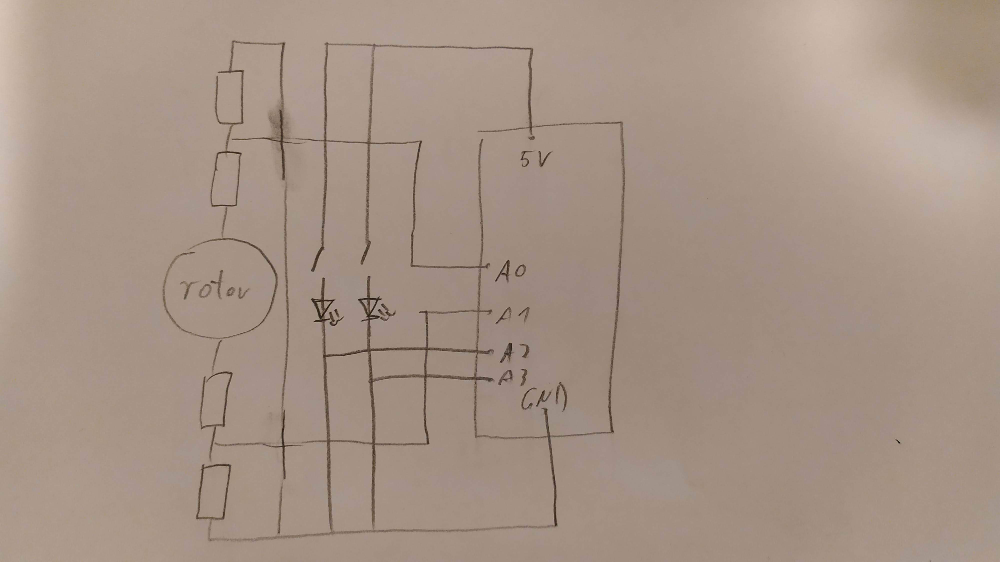

### 1. Schematic

### Arduino Program

The program reads speed and direction of wheel rotation and input of  both buttons. The LEDs are purely artistic, they switch on when
corresponding button is being pressed. The whole input is being sent to Processing as a series of newline strings (value of rotation
(negative for left)).

The controller input is the following:

  - rotor - rotate the ship
  - button 1 - add velocity pulse to the ship in the direction of rotation
  - button 2 - fire bullets (hold to fire multiple)

### Processing Program

The program will be based on the Midterm Project, with following changes as indicated in Preliminary Concept:

  - make rotation independent on movement
  - enable Arduino controller inputs
  - no need for aggregating object
  
To read the Arduino controller input:

  - check if the input String is one of the buttons, act accordingly (velocity or bullets)
  - otherwise, convert the input to float and use it to rotate the ship
