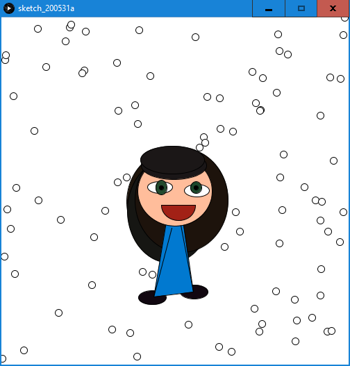
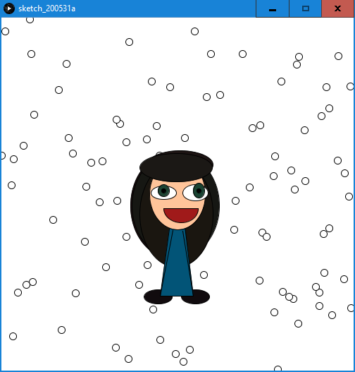
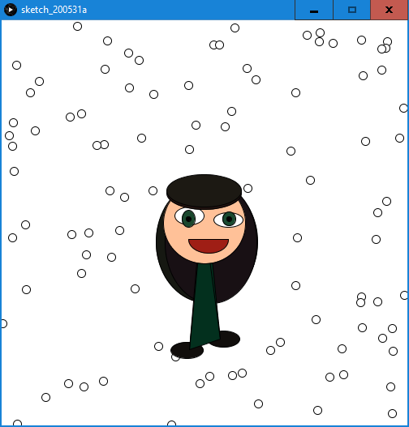
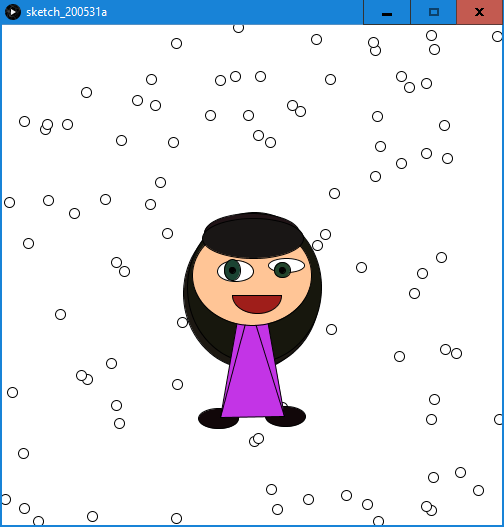
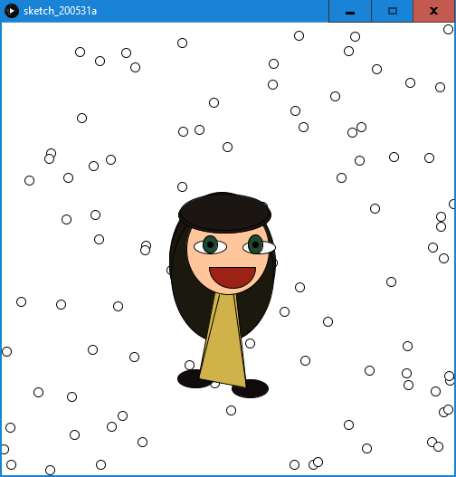

##ASSIGNMENT ONE

###RATIONALE

Due to relatively low confidence in my artistic skills, I have chosen to depict a jolly, cartoonish and little crude figure of how do I feel. Since my mood is subjected to so many factors it may appear random at some times, I have decided for semi-random generation using randomSeed function for consistency. The results along with associated seeds are presented below.

###RESUTLS

- Seed: 2\

- Seed: 7\

- Seed: 8\

- Seed: 30\

- Seed: 44\

###CODE

float near(float a, float b) { return a + (random(200*b)-100*b)/100 ; }  //frequently used function generating a random floating point number in some neighborhood of given point

void setup(){                                                            //the setup function (apparently resolves static-active mode problems)
  
  randomSeed(44);                                                        //SEED GOES HERE
  size(500, 500);                                                        //chosen size of the canvass

  int SHOES = color(near(15, 5), near(10, 5), near(12, 5));              //generate colors apriori
  int CLOTH = color(near(122, 122), near(122, 122), near(122, 122));
  int SKIN = color(near(299, 5), near(194, 5), near(152, 5));
  int WHITE = color(255, 255, 255);
  int L_EYE = color(near(30, 5), near(70, 5), near(47, 5));
  int R_EYE = color(near(30, 5), near(70, 5), near(47, 5));
  int BLACK = color(0, 0, 0);
  int LIPS = color(near(159, 5), near(31, 5), near(25, 5));
  int HAIR1 = color(near(26, 5), near(21, 5), near(17, 5));
  int HAIR2 = color(near(26, 5), near(21, 5), near(17, 5));
  int HAIR3 = color(near(26, 5), near(21, 5), near(17, 5));
  int HAIR4 = color(near(29, 5), near(23, 5), near(19, 5));
  int HAIR5 = color(near(29, 5), near(23, 5), near(19, 5));
  
  float[] circles = new float[200];                                      //prepare some nice background noise by positioning the circles
  for(int i=0; i<200; i=i+1){
    circles[i] = random(500);
  }
  
  stroke(color(255, 255, 255));                                          //create white background
  fill(color(255, 255, 255));
  rect(0, 0, 500, 500);
  
  stroke(color(0, 0, 0));
  
  for(int i=0; i<200; i=i+2){                                            //create the background
    circle(circles[i], circles[i+1], 10);
  }

  fill(HAIR1);                                                           //1st layer - hair
  ellipse(near(250, 10), near(270, 10), near(120, 20), 150);
  fill(HAIR2);
  ellipse(near(250, 10), near(270, 10), near(120, 20), 150);
  fill(HAIR3);
  ellipse(near(250, 10), near(270, 10), near(120, 20), 150);

  fill(SHOES);                                                           //2nd layer - body
  float LFX = near(225, 10);
  float LFY = near(400, 10);
  float RFX = near(275, 10);
  float RFY = near(400, 10);
  ellipse(LFX-near(2, 2), LFY+near(1, 1), 40, 20);
  ellipse(RFX+near(2, 2), RFY+near(1, 1), 40, 20);
  fill(CLOTH);
  triangle(250, near(215, 10), LFX, LFY, RFX, RFY);
  line(near(245, 5), near(300, 5), LFX, LFY);
  line(near(255, 5), near(300, 5), RFX, RFY);
  fill(SKIN);
  ellipse(250, 250, near(100, 25), 100);

  fill(WHITE);                                                           //3rd layer - eye associated stuff
  float LX = near(230, 5);
  float LY = near(245, 5);
  float RX = near(280, 5);
  float RY = near(245, 5);
  ellipse(LX, LY, 36, near(18, 5));
  ellipse(RX, RY, 36, near(18, 5));

  fill(L_EYE);
  LX = near(LX, 2);
  LY = near(LY, 2);
  ellipse(230, 245, 16, near(18, 4));
  fill(R_EYE);
  RX = near(RX, 2);
  RY = near(RY, 2);
  ellipse(280, 245, 16, near(18, 4));

  fill(BLACK);
  LX = near(LX, 2);
  LY = near(LY, 2);
  RX = near(RX, 2);
  RY = near(RY, 2);
  ellipse(230, 245, 6, 6);
  ellipse(280, 245, 6, 6);
  
  fill(HAIR4);                                                         //4th layer - front hair
  ellipse(near(250, 5), near(210, 5), near(100, 10), 40);
  fill(HAIR5);
  ellipse(near(250, 5), near(210, 5), near(100, 10), 40);
  
  fill(LIPS);                                                          //5th layer - smiley mouth
  arc(255, 270, near(45, 10), near(45, 10), 0, PI, CHORD);
  
}
