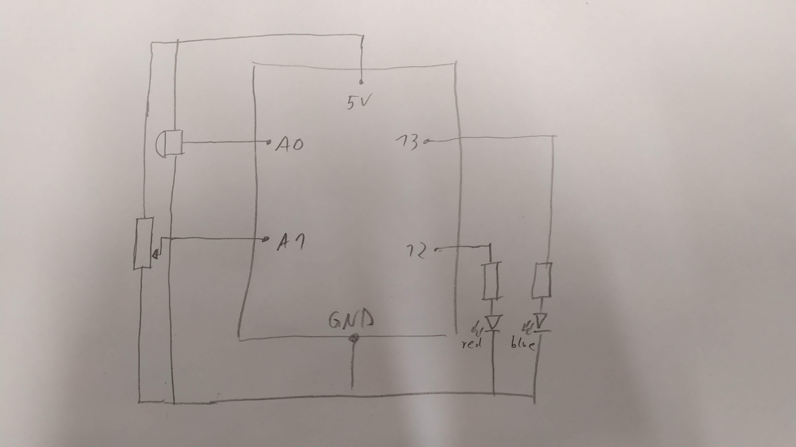
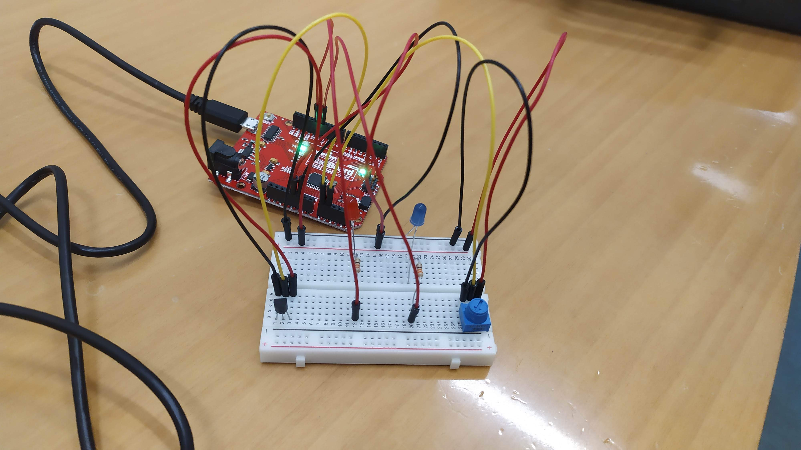
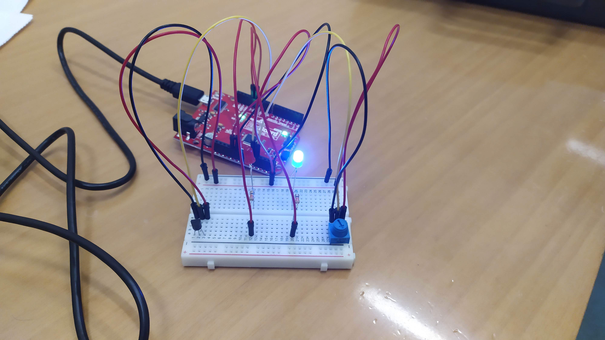
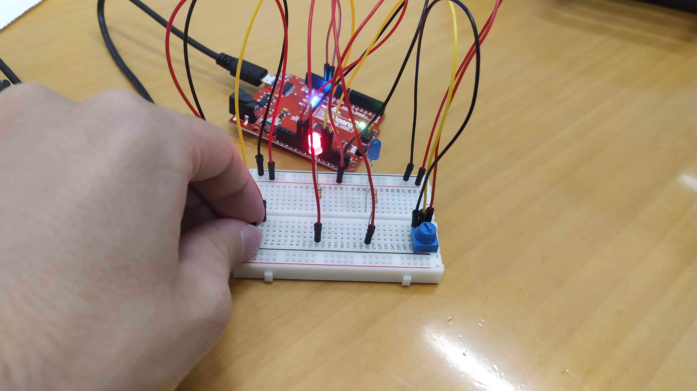

## ASSIGNMENT SEVEN

### PLAN

The system consists of digital input controlled by potentiometer and analog input controlled bu temperature sensor. The sensor is calibrated so that touching it causes it to send signal denoting the temperature rise.

The temperature sensor toggles on the red led. Ideally the brightness would be proportional to the temperature rise, but the prject turned out to be hard to scale. Turning the potentiometer to 'HIGH' volatage toggles on the blue LED that turns on only when the temperature is 'low' (callibrated to untouched sensor). In other words, when toggled on the blue LED turns on only when red LED turns off. 

### BUILD

- the scheme\

- initially the potentiometer (blue) toggled 'LOW', no light\

- potentiometer toggled on, blue LED indicates 'low' temperature\

- touching the temperature sensor switches the leds for the red one indicating 'high' temperature\

### CODE

void setup() {
  pinMode(12, OUTPUT);
  pinMode(13, OUTPUT);
  Serial.begin(9600);
  Serial.println("HELLO!");
}

void loop() {
  int temperatureSensor = analogRead(A0)-162;
  int potentiometer = digitalRead(A1);
  Serial.println("temperature:");
  Serial.println(temperatureSensor);
  Serial.println("ptoentiometer:");
  Serial.println(potentiometer);
  if(temperatureSensor > 0) analogWrite(13, temperatureSensor*100);
  else digitalWrite(13, LOW);
  if(potentiometer == HIGH) {
    if(temperatureSensor < 0) analogWrite(12, -temperatureSensor*100);
    else digitalWrite(12, LOW);
  }
  else digitalWrite(12, LOW);
}
