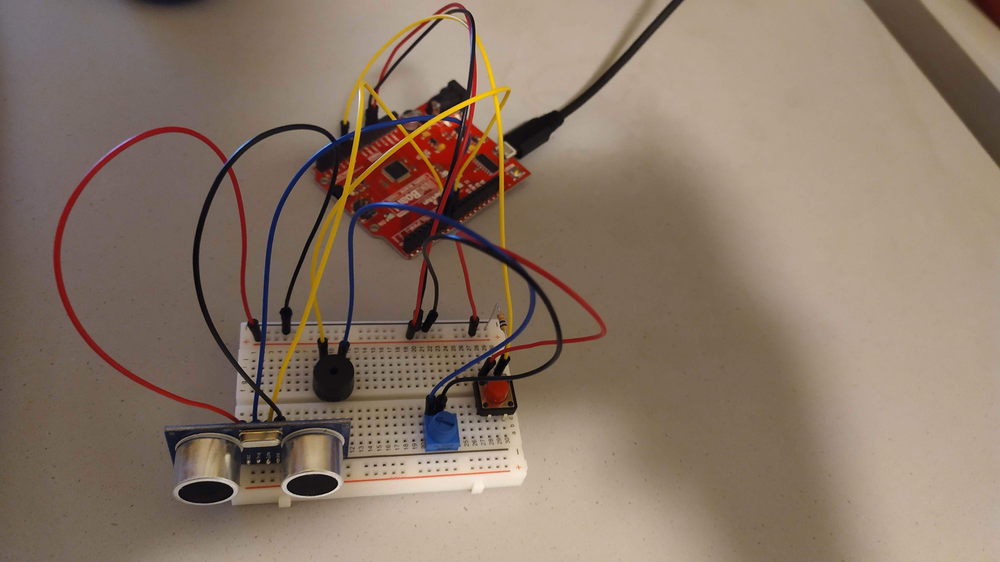

## ASSIGNMENT EIGHT

### PLAN

The system consists of one button, distance sensor, speaker and potentiometer to regulate the speaker volume.

The user is playing the sound by pressing the button. The pitch is dependent on distance sensor's reading, mapped form up to a dozen or so centimeters to the scope of two misical scales. The distance sensor can be easily regulated with the second hand.

### BUILD

- the scheme\

- circuit setup\

### VIDEO

(for video consult video.mp4)

### PROBLEMS

For some reason, the speaker gives some background sound even if supposedly turned off. This sound is hardly within hering treshold, however for one reason or another the phone recorded it quite clearly (see video).

### CODE

#include "pitches.h"

const int pingPin = 7;
const int echoPin = 6;

int notes[] = {NOTE_C4, NOTE_D4, NOTE_E4, NOTE_F4, NOTE_G4, NOTE_A4, NOTE_B4, NOTE_C5, NOTE_D5, NOTE_E5, NOTE_F5, NOTE_G5, NOTE_A5, NOTE_B5, NOTE_C6};
int numberOfNotes = 15;
int noteDuration = 4;
int speakerPinNumber = 8;

void setup() {
  pinMode(8, OUTPUT);
  Serial.begin(9600);
  Serial.println("HELLO!");
}

void loop() {
  long duration, cm;
  pinMode(pingPin, OUTPUT);
  digitalWrite(pingPin, LOW);
  delayMicroseconds(2);
  digitalWrite(pingPin, HIGH);
  delayMicroseconds(10);
  digitalWrite(pingPin, LOW);
  pinMode(echoPin, INPUT);
  duration = pulseIn(echoPin, HIGH);
  cm = microsecondsToCentimeters(duration);
  
  int button = digitalRead(A1);
  if(button==HIGH){
    tone(speakerPinNumber, notes[constrain(map(cm, 0, 16, 0, numberOfNotes-1), 0, numberOfNotes-1)], noteDuration);
    delay(noteDuration*1.3);
  }
}

long microsecondsToCentimeters(long microseconds) {
   return microseconds / 29 / 2;
}
