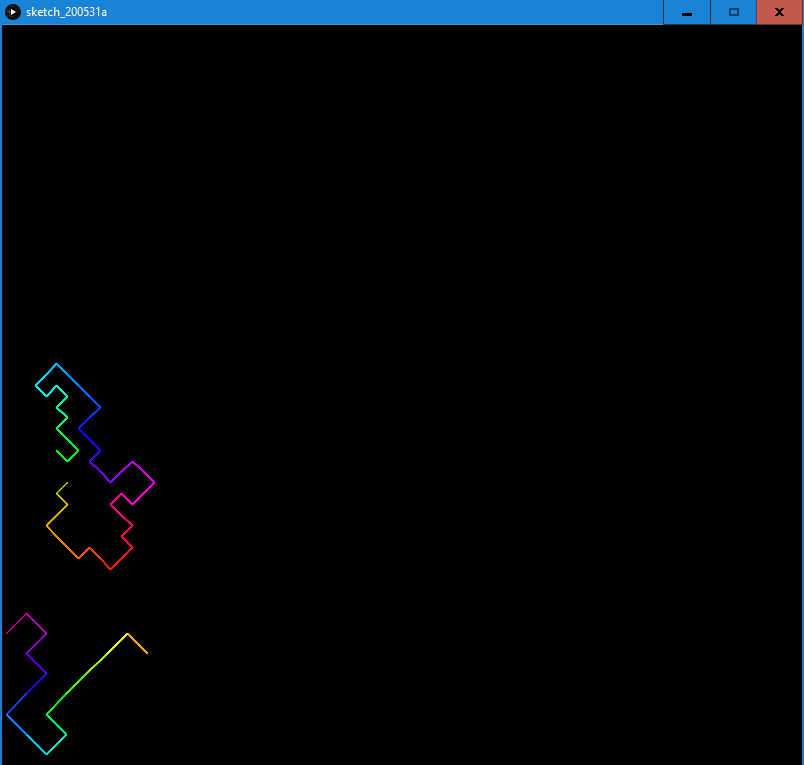
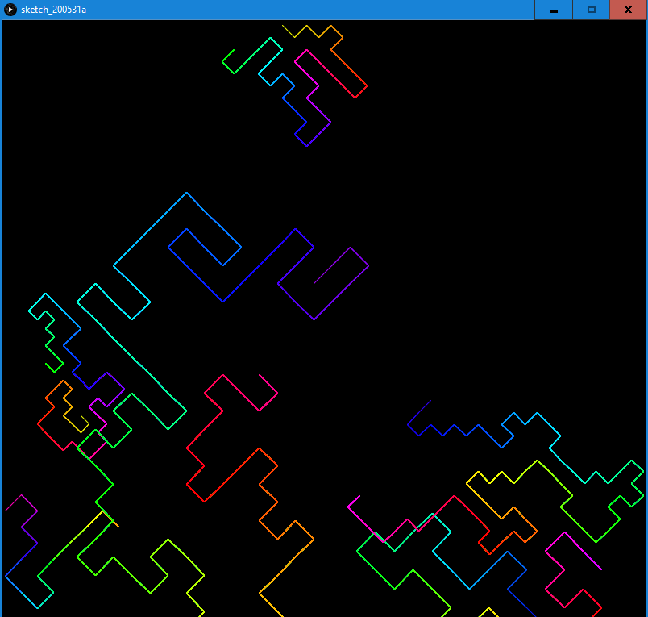
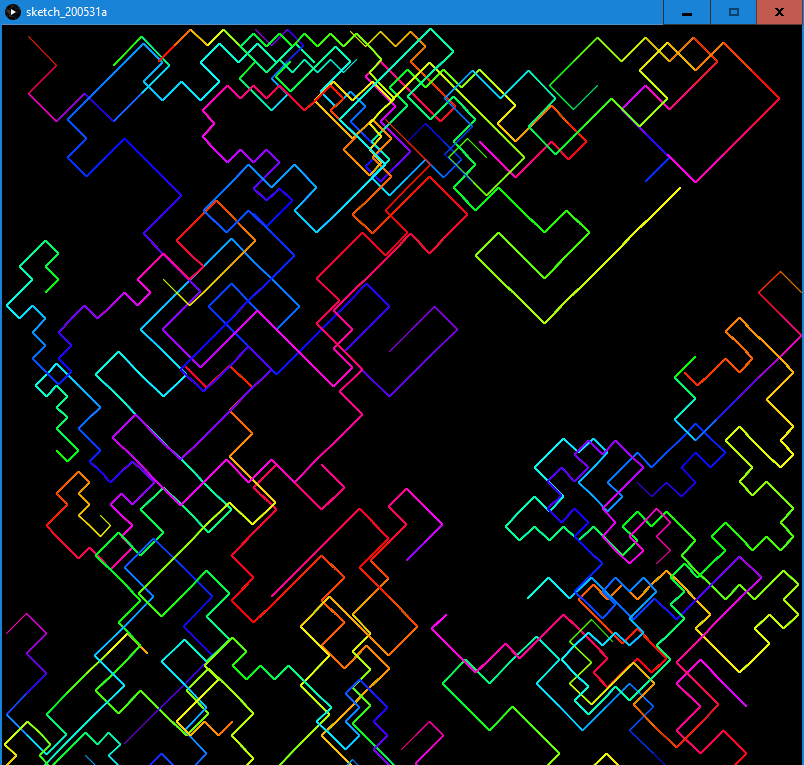

## ASSIGNMENT TWO

### RATIONALE

The story with randomly generated art continues. This time I attempted to generate a developing set of color-shifting curves with the rule that one cannot intersect itself - in that case it ands and a new one is added.\
The curve was decided to be oriented in a diagonal frame allowing it to move only at right angles, in order to keep the image somewhat 'coherent'.\
Initially the program was allowing only one curve at a time, however that option was commented due the choice of arbitrary aesthetics.

### RESUTLS

- humble beginning, 2 curves\

- adding next elements\

- the composition progresses\

- and progresses\

- ...\

### CODE
#### comment - for some reason git editor recognized only part of the code as the code, not sure why

float near(float a, float b) {                      //random within certain neighborhood function
  return a + (random(200*b)-100*b)/100;
}

color getColor(int a){                              //periodic function mapping int to a color on rgb wheel
  a = a%1530;
  color c;
  if(a<255){
    c = color(255, a%255, 0);
  }else if(a<510){
    c = color(255-a%255, 255, 0);
  }else if(a<765){
    c = color(0, 255, a%255);
  }else if(a<1020){
    c = color(0, 255-a%255, 255);
  }else if(a<1275){
    c = color(a%255, 0, 255);
  }else{
    c = color(255, 0, 255-a%255);
  }
  return c;
}

boolean NEW;                                        //global coordinates, parameters and control variables
boolean allowed;
int dir;
int shift;
float side;
float pointX;
float pointY;
float newPointX;
float newPointY;
FloatList curveX;
FloatList curveY;
IntList tested;

void setup(){                                       //setup function
                                                    //  set the size, frame rate and and background, initiate new curve
  size(800,800);
  frameRate(20);
  background(0);
  NEW = true;

}

void draw(){                                        //draw function
  
  if(NEW){                                          //if new curve is initiated, generate side length and starting point, clear X and Y lists
    side = near(20, 10);
    shift = int(random(1530));
    pointX = random(800);
    pointY = random(800);
    curveX = new FloatList();
    curveY = new FloatList();
    curveX.append(pointX);
    curveY.append(pointY);
    NEW = false;
  }

  //background(0);                                  //clear to allow only one curve at a time (initially disabled)
  
  tested = new IntList();                           //clear the tested direction list
  
  for(int k=0; k<4; k++){                           //the curve progresses diagonally, check 4 aviable directions randomly
    
    do{                                             //take random direction untill its a new one and append it to the list
      dir = int(random(4));
    }while(tested.hasValue(dir));
    tested.append(dir);
    
    if(dir==0){                                     //make new point in corresponding direction
      newPointX = pointX + side;
      newPointY = pointY + side;
    }else if(dir==1){
      newPointX = pointX + side;
      newPointY = pointY - side;
    }else if(dir==2){
      newPointX = pointX - side;
      newPointY = pointY - side;
    }else{
      newPointX = pointX - side;
      newPointY = pointY + side;
    }
    
    allowed = true;
    
    for(int i=0; i<curveX.size(); i++){             //don't allow for crossing or exceeding the display. chose again if wrong.
      if( (abs(curveX.get(i)-newPointX)<side/10 && abs(curveY.get(i)-newPointY)<side/10) || newPointX <= 0 || newPointX >= 800 || newPointY <= 0 || newPointY >= 800 ){
        allowed = false;
        break;
      }
    }
    
    if(allowed){                                    //if the right point was chosen update the curve
      curveX.append(newPointX);                     //  the color is parametrized to always gradient the entire wheel
      curveY.append(newPointY);                     //  with curve-specific shift regardles the length
      for(int i=0; i<curveX.size()-1; i++){
        stroke(getColor(shift +i*1350/curveX.size()));
        line(curveX.get(i), curveY.get(i), curveX.get(i+1), curveY.get(i+1));
      }
      pointX = newPointX;
      pointY = newPointY;
      break;
    }else if(tested.size()==4){                     //otherwise, if all directions were tested (dead end) create a new curve
      NEW = true;      
    }
    
  }

}

### FURTHER DEVELOPMENT
- make curve recognize others
  - store list of lists for all the curves currently in stage
  - instead of point neighborhoos check for actual segment crossing
  - account for curves generated already in 'dead ends' 
- adding human interaction
  - pause button (very convenient)
  - clear and autoclean buttons
- making curves 'smart', avoid 'dead ends' and finish after certain length
  - challenging, but can be done with DFS few steps ahead (how many?)
