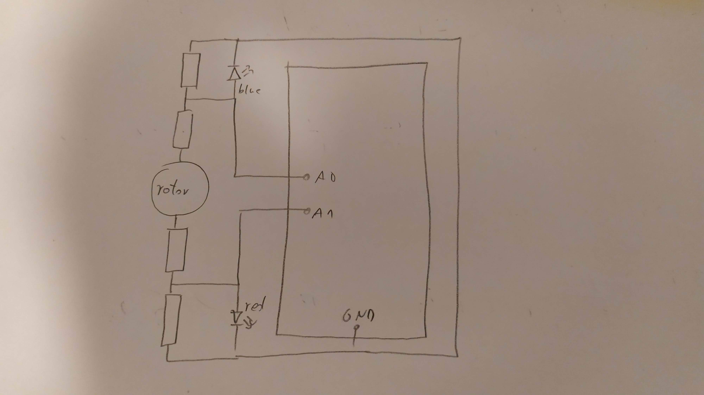
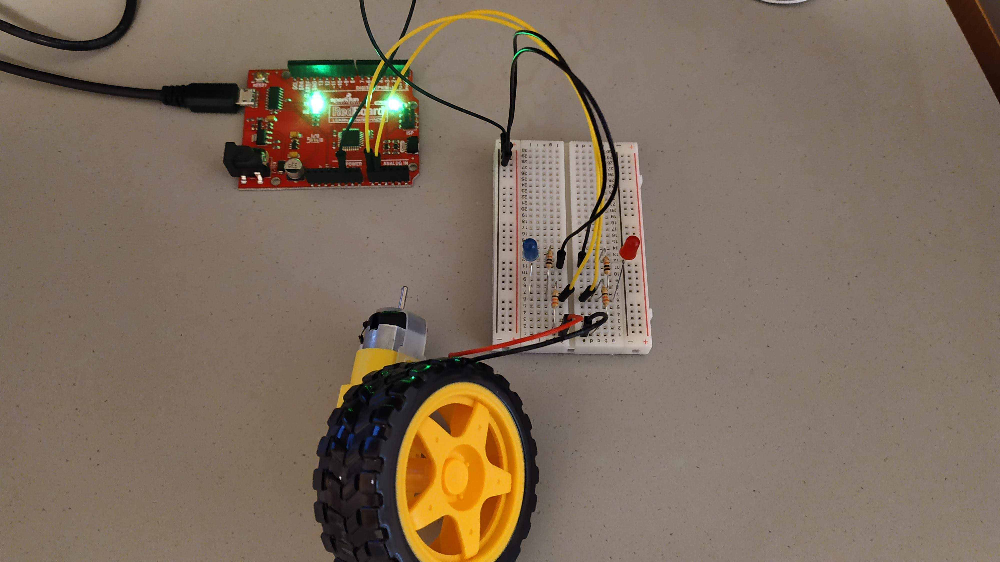
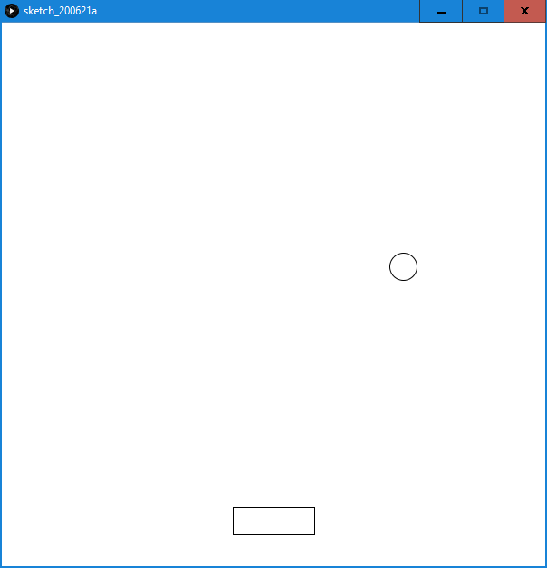

## ASSIGNMENT EIGHT

### PLAN

The simple game of pong with Arduino Servo DC motor as the controller. The player moves left and right by rotating the wheel to bounce the falling ball up. Failure generates another ball.

Ideally, the motor would have two working LEDs indicating the direction of rotation, those however turned out to work only for very strong movements.

### BUILD

- the scheme\

- circuit setup\

- the game otlay is relatively simple\

### CODE

#### ARDUINO

void setup() {
  pinMode(A0, INPUT);
  pinMode(A1, INPUT);
  Serial.begin(9600);
  Serial.println("HELLO!");
}

void loop() {
  int right = analogRead(A1);
  int left = analogRead(A0);
  int dir = 0;
  if(right>0 && left==0) dir = right;
  if(left>0 && right==0) dir = -left;
  Serial.println(dir);
  delay(2);
}

#### PROCESSING

import processing.serial.*;

class Ball{
  
  PVector pos, vel;
  float rad;
  
  Ball(float posX, float posY, float velX, float velY){
    pos = new PVector(posX, posY);
    vel = new PVector(velX, velY);
    rad = 30;
  }
  
  void display(){
    circle(pos.x, pos.y, rad);
  }
  
  void move(){
    pos = pos.add(vel);
  }
  
  void collidewalls(){
    if(pos.x<=rad || pos.x>=width-rad){
      vel = new PVector(-vel.x, vel.y);
    }
  }
  
  void collide(Player P){
    if(abs(pos.x-P.pos.x) <= P.dimX/2 && pos.y+rad >= P.pos.y-P.dimY/2){
      vel = new PVector(vel.x, -vel.y);
      vel.add(P.vel);
      vel = vel.mult(0.95);
      pos.y = P.pos.y-P.dimY/2-rad;
    }
  }
  
  void update(Player P){
    move();
    collidewalls();
    vel = vel.add(new PVector(0, grav));
    collide(P);
    display();
  }
  
}

class Player{
  
  PVector pos, vel;
  float dimX, dimY;
  
  Player(float posX, float posY, float velX, float velY){
    pos = new PVector(posX, posY);
    vel = new PVector(velX, velY);
    dimX = 90;
    dimY = 30;
  }
  
  void display(){
    rectMode(CENTER);
    rect(pos.x, pos.y, dimX, dimY);
  }
  
  void move(){
    pos = pos.add(vel);
  }

  void collidewalls(){
    if(pos.x<0 || pos.x>width){
      pos = new PVector(width-pos.x, pos.y);
    }
  }
  
  void update(float v){
    vel = vel.add(v, 0);
    move();
    vel = vel.mult(0.4);
    collidewalls();
    display();
  }
  
}

float grav = 0.9;
float inByte;
Player P;
Ball B;

Serial myPort;

void setup(){

  size(600, 600);
  frameRate(25);
  stroke(color(0));

  myPort = new Serial(this, Serial.list()[0], 9600);
  myPort.bufferUntil('\n');
  
  setNew();

}

void setNew(){

  B = new Ball(random(width-60), random(20)+90, random(20)-10, 0);
  P = new Player(width/2, 550, 0, 0);
  
}

void draw(){
  
  background(255);
  
  P.update(inByte);
  B.update(P);
  
  if(B.pos.y > P.pos.y) setNew();
  
}

void serialEvent(Serial myPort){
 
  String inString = myPort.readStringUntil('\n');
  if(inString!=null){
    inString = trim(inString);
    inByte = float(inString);
  }
  
}
