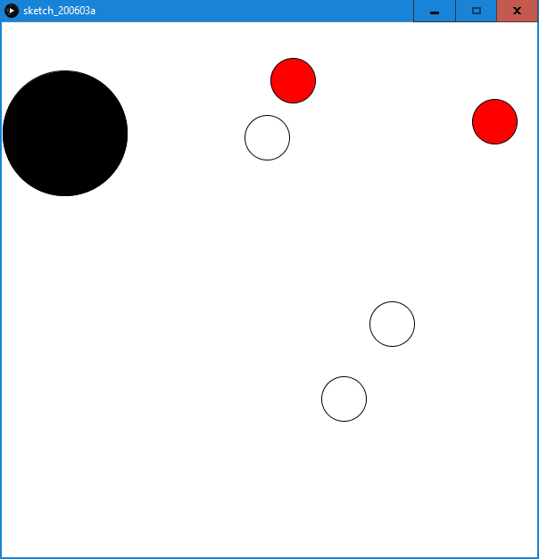
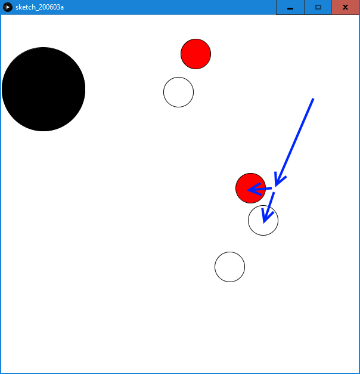
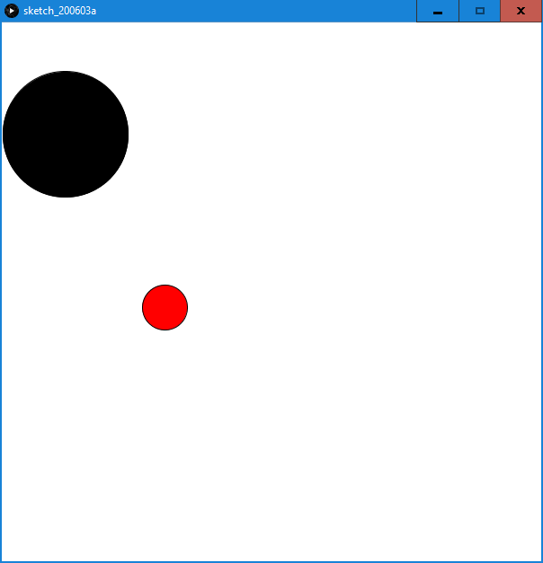

## ASSIGNMENT THREE

### RATIONALE

The rules of the game are simple. Use the red tockens (Players) to remove the white tockens (Pucks) by moving them into black circles (Holes).
The game is billiards-style and intuitive. To launch the Players forward click on them and drag back.
But beware, for Players can also fall into the holes and when out of moves you lose.

The game appears 'fun-yet-buggy' and even developed a slight 'justo one more stage' symptom. Huge potential for further fixes and development. 

### RESUTLS
#### for full immersion I recommand trying to run the game

- pull the sling\

- fuel the Player\

- collide with Pucks\

- attempt to clear the stage by puting all Pucks in the holes\

### CODE

class Vec{                                //2D vector class
  
  float X;
  float Y;
  
  Vec(float nX, float nY){
    X = nX;
    Y = nY;
  }
  
  Vec add(Vec v){
    return new Vec(X+v.X, Y+v.Y);
  }
  
  Vec add(float nX, float nY){
    return new Vec(X+nX, Y+nY);
  }
  
  float len(){
    return sqrt(X*X+Y*Y);
  }
  
}

class Circle{                             //Circle superclass
  
  float rad;
  Vec  pos;
  Vec vel;
  color col;
  
  Circle(float r, float pX, float pY, float vX, float vY, color c){
    rad = r;
    pos = new Vec(pX, pY);
    vel = new Vec(vX, vY);
    col = c;
  }
  
  boolean inside(float X, float Y){       //is given point inside the circle
    return ( (pos.X-X)*(pos.X-X)+(pos.Y-Y)*(pos.Y-Y) < rad*rad );
  }
  
  boolean inside(Circle C){               //is given circle inside the circle
    return inside(C.pos.X, C.pos.Y);
  }
  
  boolean touch(Circle C){                //are the two circles touching
    return ( (pos.X-C.pos.X)*(pos.X-C.pos.X)+(pos.Y-C.pos.Y)*(pos.Y-C.pos.Y) < (rad+C.rad)*(rad+C.rad) && (pos.X-C.pos.X)*(vel.X-C.vel.X)+(pos.Y-C.pos.Y)*(vel.Y-C.vel.Y) < 0 );
  }
  
  void move(){                            //move the circle by its velocity
    pos = pos.add(vel);
  }
  
  void display(){                         //display the circle
    fill(col);
    circle(pos.X, pos.Y, rad*2);
  }
  
  void collidewalls(){                    //collide with frame walls
    if( (pos.X<rad && vel.X<0) || (pos.X>600-rad && vel.X>0) ) vel.X = -vel.X;
    if( (pos.Y<rad && vel.Y<0) || (pos.Y>600-rad && vel.Y>0) ) vel.Y = -vel.Y;
  }
  
  void slow(){                            //slow down by given friction coefficient (fully stop is small enough)
    if(vel.len()<0.1) vel=new Vec(0, 0);
    else vel = vel.add(-fric*vel.X, -fric*vel.Y);
  }
  
  void update(){                          //facade function, evolve circle in time 
    display();
    collidewalls();
    move();
    slow();
  }
  
  void collide(Circle C){                 //collide with other circle (exchange radial velocity component)
    float t = atan( (pos.Y-C.pos.Y)/(pos.X-C.pos.X) );
    float vr = vel.X*cos(t) + vel.Y*sin(t);
    float vt = vel.X*sin(t) + vel.Y*cos(t);
    float cvr = C.vel.X*cos(t) + C.vel.Y*sin(t);
    float cvt = C.vel.X*sin(t) + C.vel.Y*cos(t);
    vel = new Vec( cvr*cos(t)+vt*sin(t), cvr*sin(t)+vt*cos(t) );
    C.vel = new Vec( vr*cos(t)+cvt*sin(t), vr*sin(t)+cvt*cos(t) );
  }
  
}

class Player extends Circle{              //Player class (red), addin the sling to display
  
  boolean pull;
  
  Player(float r, float pX, float pY){
    super(r, pX, pY, 0, 0, color(255, 0, 0));
  }
    
  void display(){
    super.display();
    if(pull)
      line(pos.X, pos.Y, mouseX, mouseY);
  }
  
  void update(){
    super.update();
    if( mousePressed && inside(mouseX, mouseY) ){
      pull = true;
    }
    if( !mousePressed ){
      if(pull){
        vel=vel.add((pos.X-mouseX)/12, (pos.Y-mouseY)/12);
      }
      pull = false;
    }
  }
  
}

class Puck extends Circle{                //Puck class (white)
  
  Puck(float r, float pX, float pY){
    super(r, pX, pY, 0, 0, color(255, 255, 255));
  }
  
}

class Hole extends Circle{                //Hole class (black)
  
  Hole(float r, float pX, float pY){
    super(r, pX, pY, 0, 0, color(0, 0, 0));
  }
  
}

float fric = 0.01;                        //global friction (actually resistance) parameter
ArrayList<Player> P;                      //Circle lists
ArrayList<Puck> C;
ArrayList<Hole> H;
Player Pi, Pj;                            //Used for current Circle object
Puck Ci, Cj;
Hole Hi;
int WIN;                                  //game control parameter

void setup(){                             //setup function, set size, framerate, stroke and new game

  size(600, 600);
  frameRate(25);
  stroke(color(0));

  setNew();

}

void setNew(){                            //initiate 3 circle lists of randomised sizes (at least 1)

  P = new ArrayList<Player>(0);
  C = new ArrayList<Puck>(0);
  H = new ArrayList<Hole>(0);
  
  int p = int(random(3))+1;
  int c = int(random(10))+1;
  int h = int(random(4))+1;
  for(int i=0; i<p; i++) P.add(new Player(25, random(600-50)+25, random(600-50)+25));
  for(int i=0; i<c; i++) C.add(new Puck(25, random(600-50)+25, random(600-50)+25));
  for(int i=0; i<h; i++) H.add(new Hole(random(100)+25, random(600-50)+25, random(600-50)+25));
  
  WIN = 0;
  
}

void draw(){                              //draw function, not much here, check the game parameter and delegate the drawing
  
  if(WIN>0){
    winScreen();
  }else if(WIN<0){
    loseScreen();
  }else{
    play();
  }
  
}

void winScreen(){                         //win screen, click to continue

  background(0, 255, 0);

  if(mousePressed) setNew();
  
}

void loseScreen(){                        //lose screen, click to continue

  background(0, 0, 0);
  
  if(mousePressed) setNew();
  
}

void play(){                              //play screen, he actual part

  background(255);                        //set background
  
  for(int i=0; i<H.size(); i++){          //for all Holes, check for Players and Pucks falling in
    Hi = H.get(i);
    Hi.update();
    for(int j=0; j<P.size(); j++){
      Pj = P.get(j);
      if(Hi.inside(Pj)) P.remove(j);
    }
    for(int j=0; j<C.size(); j++){
      Cj = C.get(j); 
      if(Hi.inside(Cj)) C.remove(j);
    }
  }
  
  for(int i=0; i<P.size(); i++){          //for all Players, check for collisions with Players (except self) and Pucks
    Player Pi = P.get(i);
    Pi.update();
    for(int j=0; j<P.size(); j++){
      Pj = P.get(j);
      if(i!=j && Pi.touch(Pj)) Pi.collide(Pj);
    }
    for(int j=0; j<C.size(); j++){
      Cj = C.get(j);
      if(Pi.touch(Cj)) Pi.collide(Cj);
    }
  }
  
  for(int i=0; i<C.size(); i++){          //for all Pucks, check for collissions with Pucks (except self)
    Ci = C.get(i);
    Ci.update();
    for(int j=0; j<C.size(); j++){
      Cj = C.get(j);
      if(i!=j && Ci.touch(Cj)) Ci.collide(Cj);
    }
  }
  
  if (P.size()==0) WIN = -1;              //lose if no Players are present, win if no pucks are present
  else if(C.size()==0) WIN = 1;

}

### FURTHER DEVELOPMENT
- fixing the self-fueling collision bug
  - honestly no idea
- avoid the 'unfair' scenarios when all Players are generated initially inside the Holes
  - for each Player generation chceck 'one vs rest' with the Holes using inside function
- delegate 'check one vs the rest' functions to the objects
  - possibility for creating list-type container objects for this purpose
- add relative mass as the puck parameter
  - represented by color, changes the transmitted velocity factor
- add new features, such as moving holes, initial motion of pucks, gravity / winds, magnets
  - decorator design pattern seems very suitable for this purpose
- improve the endgame screens
  - sorry, had little time
