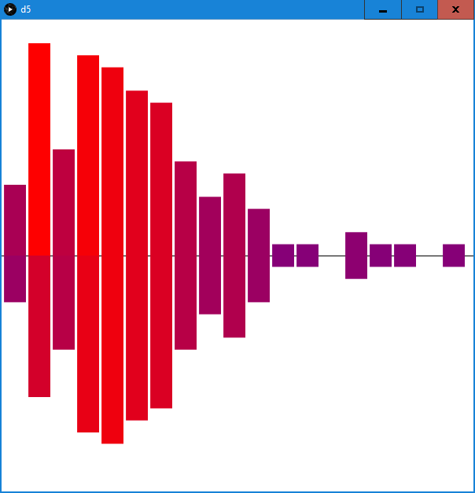
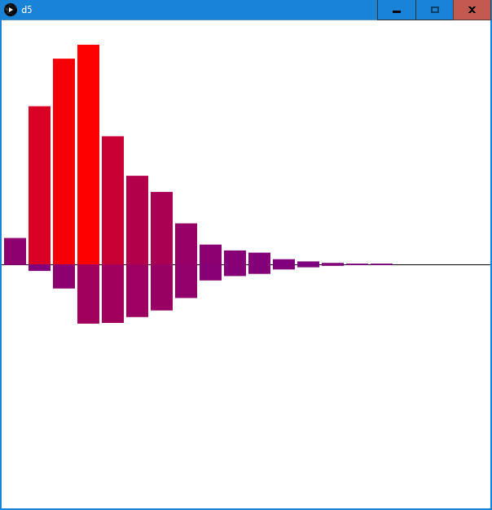
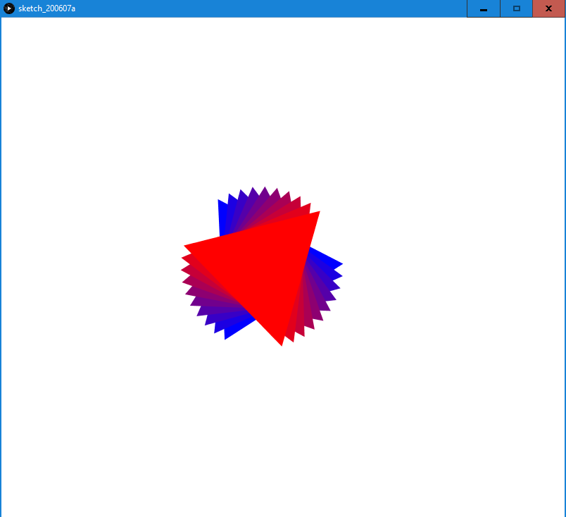
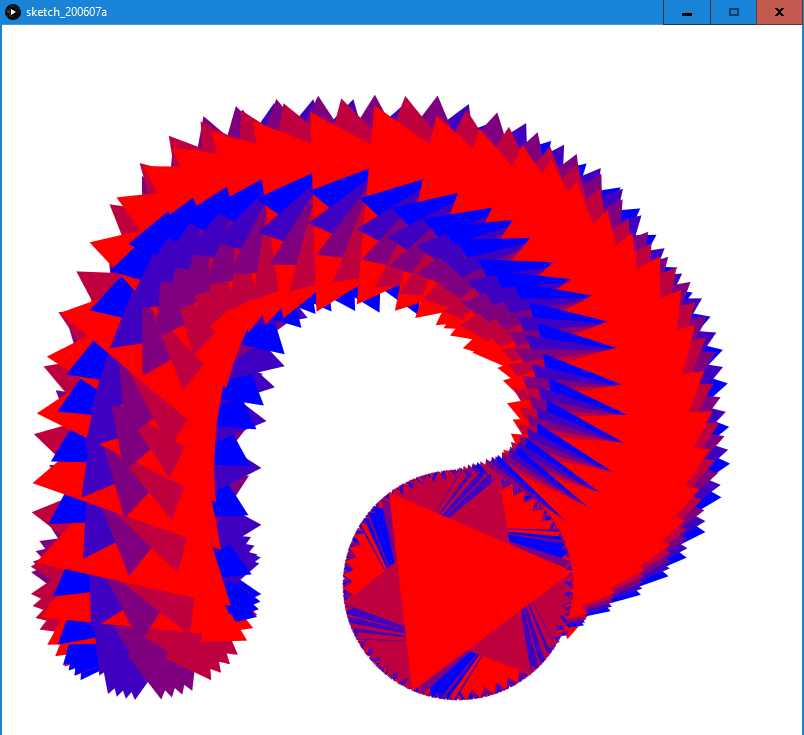

## ASSIGNMENT TWO (PART 1)

### RATIONALE

### RESUTLS

- \

- \

### CODE

//========================================================//
//
// The program analyses given text and outputs words by length
// statistics. The upward bars show the total instances of the
// words of given length, while the downward bars include only
// different word instances.
//
//========================================================//

String data[];                                            //global variavbles
StringList X;
int Y1[];
int Y2[];
int xmax;
int ymax;

color col(float c){                                       //iterate color from blue to red
  print();
  return color(127*(1+c/ymax), 0, 127*(1-c/ymax));
  
}

String reduce(String s){                                  //lowercase string and truncate interpunction
  
  s = s.toLowerCase();
  s = s.replaceAll("[^a-zA-Z ]", "");
  
  return s;
  
}

void setup(){                                             //setup
                                                          //set size, load data from file, merge the lines, separate by spaces, compute the data
  size(600, 600);                                         //scale X and Y 'dynamically'
  String stuff[] = loadStrings("data.txt");
  String stuff2 = "";
  for(int i=0; i<stuff.length; i++)
    stuff2 = stuff2.concat(stuff[i]);
  data = split(stuff2, ' ');
  getData();

}

void draw(){                                              //draw the graph
  
  background(255);
  
  stroke(0);
  line(0, height/2, width, height/2);                     //middle line
  
  noStroke();
  float w = width/xmax;
  for(int i=0; i<xmax; i++){
    fill(col(Y1[i]));
    rect(i*w+0.1*w, height/2-0.9*(Y1[i]*height/2/ymax), 0.9*w, 0.9*(Y1[i]*height/2/ymax));  //bars up
    fill(col(Y2[i]));
    rect(i*w+0.1*w, height/2+0.9*(Y2[i]*height/2/ymax), 0.9*w, -0.9*(Y2[i]*height/2/ymax)); //bars down
  }
  
}

void getData(){                                           //compute the data
  
  X = new StringList();                                   //set the initial arrays
  Y1 = new int[100];
  Y2 = new int[100];
  for(int i=0; i<10; i++){
    Y1[i]=0;
    Y2[i]=0;
  }
  
  int len;
  xmax = 0;
  ymax = 0;
  
  for(int i=0; i<data.length; i++){                       //iterate through non-empty words
    len = reduce(data[i]).length();                       //insert them by their length to Y1 and if not repeating to Y2
    if(len!=0){                                           //keep the largest non-empty X and largest Y
      Y1[len-1]++;
      if(!X.hasValue(reduce(data[i]))){
        X.append(reduce(data[i]));
        Y2[len-1]++;
      }
      if(len>xmax){
        xmax = len;
      }
    }
  }
  
  for(int i=0; i<xmax; i++){
    if(Y1[i]>ymax){
      ymax = Y1[i];
    }
  }
  
}

### FURTHER DEVELOPMENT
- prefrably not in Java
- add axes and text descriptions
  - at current stage it caused too much adjustments with text size, requires more practice on my side
- recognize the actual words, not only their lengths and probabilities of appearing after given sequence few words back
  - that would be first step into narural language processing
- compute the curves approximating upwards and downwards graphs
  - for longer inputs, specific language is expected to create a distinct curve. After proper sampling this can be used for language recognition without knowing the meaning of words.

\

## ASSIGNMENT TWO (PART 2)

### RATIONALE

### RESUTLS

- \

- \

### CODE

### FURTHER DEVELOPMENT
