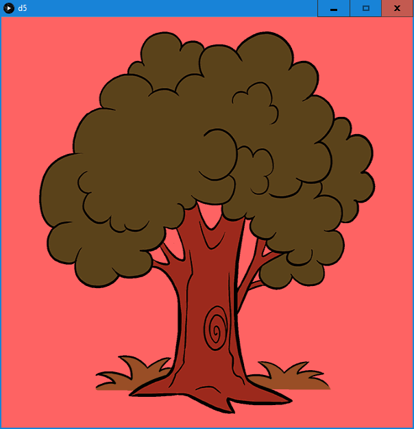

## ASSIGNMENT FIVE

### RATIONALE

This project was a collaboration between me (Krzysztof 'Kris' Warmuz) and Vivi Zhu. It is the natural progression of the simple example we designed during the class groupwork and our joined efforts allowed to create something more remarkable than the previous homeworks. The distribution of work was according to area of 'specialisation', I did most of the coding, while most of the design choices, graphic choices and graphic creation was on Vivi's side.

The game is a type of pictionary-vocab game. The player is presented an image and guesses its name via text input. The program recognizes the answer as either valid or invalid, informs the player and rolls another image. Also, a short tutorial with instruction is present at the beginning.

Also, this can be considered a playable demo. Like really, the pictures are trivial and not many.

### RESUTLS
#### for full immersion I recommand run the game yourself!

- intro image, thanks Vivi!\

- ok, that's rather simple\

- it's a dog, right?\

- sure it is!\

- is this a dog?\

- nope!\

### CODE

//==============================================//
// The program is a simple pictionary game. It
// displays a random image from the list and the
// player guesses the word via text input (accept
// with enter). THe program responds was the guess
// right or wrong and proceeds to show next image. 
//==============================================//

PImage[] images;                                //global variables
PImage photo;
String[] answers;
int number;
String text;
int WIN;

void getPhoto(){                                //load random photo and answer, reset game state and text
  
  number = 1+int(random(images.length-1));
  photo = images[number];
  photo.resize(width, height);
  WIN = 0;
  text = "";
  
}

void button(float x, float y){                  //textfield
  
  pushMatrix();
  translate(x, y);
  fill(255);
  rect(-100, -25, 200, 50);
  fill(0);
  if(text.length()<10)
    textSize(32);
  else
    textSize(32-3.0/2.0*(text.length()-9));
  text(text, -95, 12);
  popMatrix();  
  
}
  

void setup(){                                   //setup function
                                                //set size, background, fill and stroke
  size(600, 600);                               //load image and answer arrays
                                                //get first photo
  background(255);
  stroke(0);
  noFill();

  images = new PImage[] {loadImage("start.png"), loadImage("dog.png"), loadImage("tree.png")};
  answers = new String[] {"start", "dog", "tree"};
  
  number = 0;
  photo = images[0];
  photo.resize(width, height);
  WIN = 0;
  text = "";

}

void draw(){                                    //draw function
                                                //depending on game state delegate functionality to subfunctions
  if(WIN>0){
    winScreen();
  }else if(WIN<0){
    loseScreen();
  }else{
    play();
  }
  
}

void play(){                                    //guessing stage, enable txt input
  
  tint(255, 255, 255);
  image(photo, 0, 0);
  button(width/2, height-50);
  
}

void winScreen(){                               //win screen, apply green tint and reset on mouse press
  
  tint(100, 255, 100);
  image(photo, 0, 0);
  if(mousePressed) getPhoto();
  
}

void loseScreen(){                              //lose screen, apply red tint and reset on mouse press
  
  tint(255, 100, 100);
  image(photo, 0, 0);
  if(mousePressed) getPhoto();
  
}

void keyPressed() {                             //button action listener, text input and allow reset on enter
  
  if(key==BACKSPACE) {
    if(text.length()>0) {
      text=text.substring(0, text.length()-1);
    }
  }
  else if(key==RETURN || key==ENTER) {
    if(WIN!=0){
      getPhoto();
    }
    else if(text.equals(answers[number])) {
      WIN = 1;
    }
    else{
      WIN = -1;
    }
  }
  else{
    text += key;
  }
}

### FURTHER DEVELOPMENT

- add more images
- diversify the game
  - it can basically be used as an image memo, with biology diagrams for instance
- consider some design choices
  - the input answer may stay with disabled input after verification (currently causing too much coding trouble to be resoved quickly)
  - upon wrong answer the image may stay instead of being rerolled, potentially additional hint can be displayed
- fix the tutorial
  - it should not re-roll untill the right input is made 
- add score tracking
  - display the number of right and wrong guesses over the game
- store image files and answers in the .txt file
  - very powerfull practice, it will allow to switch the content of the game simply by switching the .txt file
  - since different images will need to be loaded, the .txt file can be stored along them in separate interchangable folder
- make working font adjustment
  - like really, it seems like some sort of exponential-ish function
  - the letters are not of the same graphical length anyways
  - there totally should be some functions for that
