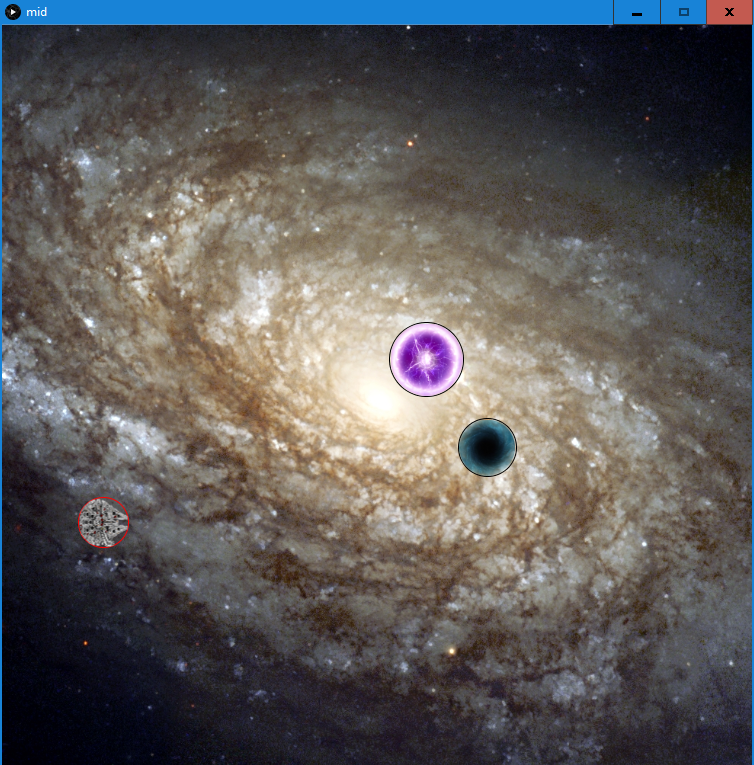

## MIDTERM ASSIGNMENT

### RATIONALE

The developed program is a simple game in which player takes command of a small and roundish spaceship with the objective to clear the stage by moving all the meteorites to the black holes and proceed to the next one.

The control of the ship is based on sling-type pullback that fuels the ship in the direction opposite to the pull. Somehow counterintuitional mechanic makes the game both distinct and challenging. The meteors can be moved indirectly via collisions with the ship or bullets that player can shoot in the direction of motion. Player can collide with own bullets, experiencing similar pushback. The ship falling into the black hole results in failure and reset of the current stage.

Every fifth stage the black holes are replaced with a boss entity, capable of repetitive motion and shooting own bullets. The aim remains unchanged, push all the meteorites into the boss avoiding falling in yourself.

### PROCESS AND DESIGN CHOICES

### RESUTLS

- \

- \

### CODE

For the code consult the code.pde file, because with documentation it is over 1000 lines.

### FURTHER DEVELOPMENT
- restructurisation
  - as suggested in June 3 assignment submission, embracing more suitable OOP patterns, such as decorator, will make the overall structure more flexible and allow for more efficient addition of the functionalities.
  - keeping the object functions, such as collission effects or movement capabilities independent rather then aggregated within given type will allow to create specific objects with desired functionality packages, going beyond the limits of Player-Puck-Hole-Bullet design.
  - This in turn would add more variety among the stages
- rebalancing
  - within the short time of development it was hard to assess what a balanced game playthrough would look like. In practice, smaller number of holes, however increeses the freedom of player movement, sometimes makes it hard to clear the stage. The intuitional approach of stage-proportional upper cap was fitting for the time, but caould be optimized further.
  - adding more variety to the bosses, such as player-directed movement or gravity-pull, could make the fights less repetetive and more challenging.
- bug fixes
  - the issue of self-fueling collisions occuring when object boundaries intersect in between frames was not fully resolved
